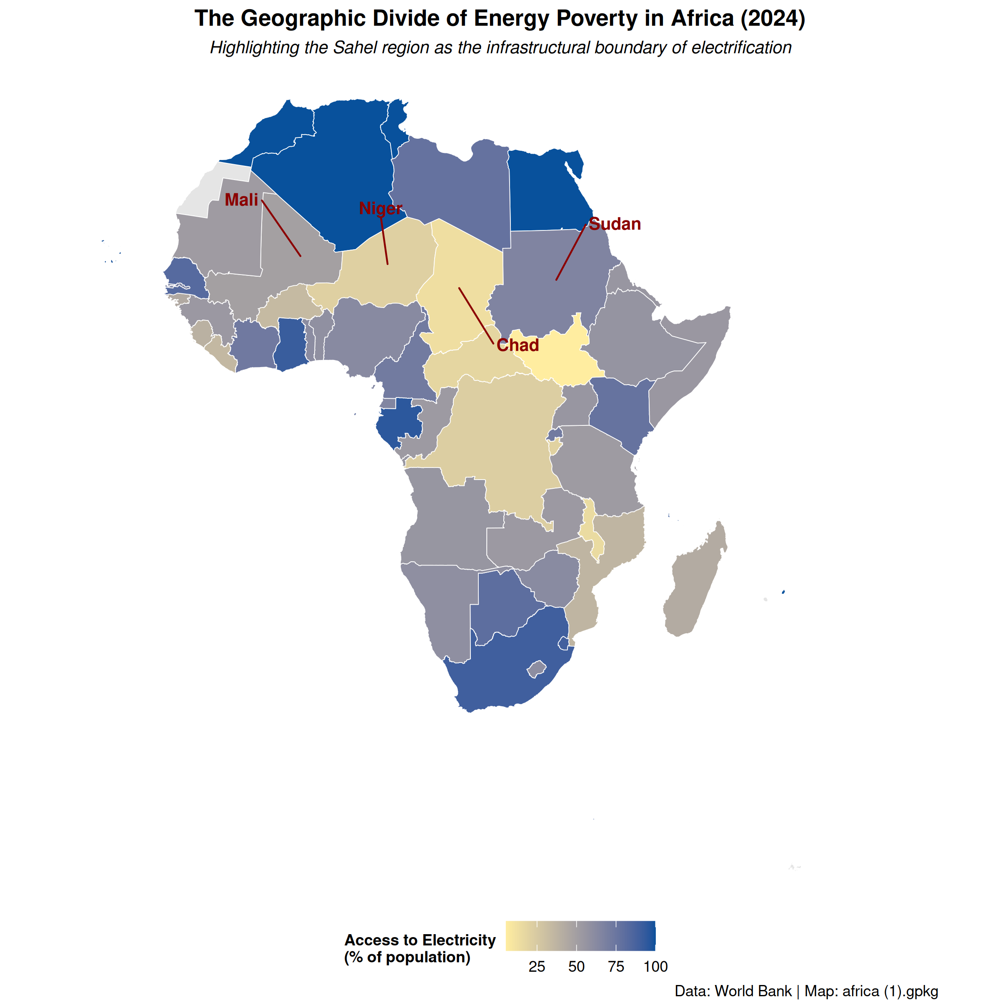

# Spatial Analysis of Energy Poverty in Africa (2024)

### Project Overview
A spatial data analysis project mapping electricity access across the African continent using 2024 World Bank data. The visualization is designed in strict adherence to Edward Tufte’s data-ink principles to clearly illustrate the infrastructural boundary created by the Sahara Desert.

### Final Visualization

### The Explanandum (Insight)
Access to electricity in Africa is sharply divided by the Sahara Desert. North African countries have achieved near-universal electrification, but the Sahel region directly to the south experiences a massive, sudden drop in access. This project highlights how extreme physical geography creates a hard boundary for basic infrastructure development. 

The map shows a clear geographic divide rather than a random distribution of energy poverty. The annotated Sahel states (Mali, Niger, Chad, and Sudan) sit right at the edge of the Sahara, where the harsh terrain makes expanding national power grids incredibly difficult and expensive. The sharp transition from 100% access in the north to rates as low as 13% in Chad proves that physical geography acts as a primary bottleneck for African infrastructure and broader economic growth.

### Tech Stack & Techniques
* **Language:** R
* **Libraries:** `sf` (Spatial mapping), `dplyr` (Data manipulation), `ggplot2` (Choropleth visualization), `ggrepel` (Professional spatial annotations)
* **Design Philosophy:** Minimized non-data ink (removed axes, coordinates, and background panels) to draw maximum attention to the regional macroeconomic contrast. 

### Data Sources
* **Spatial Boundaries:** Geopackage base map (`africa (1).gpkg`)
* **Electrification Data:** The World Bank DataBank (2024 Access to Electricity % of Population)
